# Cloudera Manager란?
**Automated deployment and configuration.**  
The fastest way to get up and running with Hadoop and Cloudera Enterprise. 

> Hadoop 및 Hadoop Eco System을 직접 설치할 수도 있지만 Cluster상의 수많은 머신에 일일이 설치하고 환경 구성을 하려면 매우 복잡한 일이 될 수 있기 때문에 이런 작업을 편하게 해주는 도구라고 생각하면 될 듯 하다.

# Cluster환경에서 CDH 설치 <sup>(with. Virtual Box)</sup>
Cloudera Manager를 설치하는 방법은 크게 2가지가 있음
1. [Automated Installation by Cloudera Manager](https://www.cloudera.com/documentation/enterprise/5-5-x/topics/cm_ig_install_path_a.html)
2. [Manual Installation Using Cloudera Manager Packages](https://www.cloudera.com/documentation/enterprise/5-5-x/topics/cm_ig_install_path_b.html)

> 첫 번째 방법은 간단한 테스트를 할 때 사용하는 방법이고 매우 쉽기(?) 때문에  
> 여기서는 실제 운영환경 설정할 떄 사용하는 두번째 방법으로 진행하겠습니다 😎

## Architecture
- 4개의 가상 서버로 Cluster 환경 구성 (~~5대로 구성하려다가 불안정해서 ㅠㅠ 4대로 줄였다는...~~)
- **taco** 는 Cloudera Manager, 나머지는 Agent

## 가상 서버 만들기
> 실습의 편의를 위해 진행할 작업을 정리한 것입니다 ^^

### 작업 순서
- Cloudera Manager 서버 구성을 먼저한 후 Agent 서버 구성
- Agent들을 효율적으로 생성하기 위해 가상서버 내보내기 기능을 활용하여 기본 가상 서버 `cm-agent.ova` 파일을 생성
- 가상서버 가져오기로 Agent들을 만든 후 각각 개별 설정 적용

### 실습 환경 및 제약조건
- 실습하는 PC의 메모리는 16GB 이상 권장
- OS는 CentOS7 사용
- taco 서버 메모리는 8192MB, burger와 pizza 서버는 1268MB로 설정
- 가상서버들의 하드디스크는 40GB 이상 권장  
  (하드용량이 너무 작으면 Install 실패함. ~~8GB로 하면 실패함~~)
- 모든 서버들의 접속과 실행은 root계정으로 하고 비밀번호도 동일하게 설정 
- 모든 서버들의 방화벽은 중지
- 서버들은 같은 Network 상에 있어야 하고 내 PC(Client)에서 접근 가능해야 함
- 아래와 같이 고정 IP 설정
    | Server | IP |
    | :---: | :----: |
    | taco | 192.168.57.111 |
    | burger | 192.168.57.112 |
    | pizza | 192.168.57.113 |
    | cookies | 192.168.57.114 |

### 고정 IP 설정 방법
- Virtal Box 가상머신 네트워크 어댑터 설정은 **NAT**와 **호스트 전용 어댑터**를 설정
- Virtual Box 네트워크 어댑터 중 `호스트 전용 어댑터`**(NAME=enp0s8)** 찾기
    ```bash
    $> ip addr
    1: lo: <LOOPBACK,UP,LOWER_UP> mtu 65536 qdisc noqueue state UNKNOWN group default qlen 1000
    link/loopback 00:00:00:00:00:00 brd 00:00:00:00:00:00
    inet 127.0.0.1/8 scope host lo
       valid_lft forever preferred_lft forever
    inet6 ::1/128 scope host
       valid_lft forever preferred_lft forever
    2: enp0s3: <BROADCAST,MULTICAST,UP,LOWER_UP> mtu 1500 qdisc pfifo_fast state UP group default qlen 1000
        link/ether 08:00:27:ca:08:c6 brd ff:ff:ff:ff:ff:ff
        inet 10.0.3.17/24 brd 10.0.3.255 scope global noprefixroute dynamic enp0s3
        valid_lft 1169sec preferred_lft 1169sec
        inet6 fe80::5eb:dc78:9b90:47d1/64 scope link noprefixroute
        valid_lft forever preferred_lft forever
    3: enp0s8: <BROADCAST,MULTICAST,UP,LOWER_UP> mtu 1500 qdisc pfifo_fast state UP group default qlen 1000
        link/ether 08:00:27:eb:5a:57 brd ff:ff:ff:ff:ff:ff
    ```

- 호스트 전용 어댑터 설정 파일 아래와 같이 변경
    ```bash
    $> vi /etc/sysconfig/network-scripts/ifcfg-enp0s8

    ### BOOTPROTO는 static으로 설정
    ### ONBOOT는 yes로 설정
    ### IPADDR은 각자 서버에 맞게 설정
        TYPE=Ethernet
        PROXY_METHOD=none
        BROWSER_ONLY=no
        BOOTPROTO=static
        DEFROUTE=yes
        IPV4_FAILURE_FATAL=no
        IPV6INIT=yes
        IPV6_AUTOCONF=yes
        IPV6_DEFROUTE=yes
        IPV6_FAILURE_FATAL=no
        IPV6_ADDR_GEN_MODE=stable-privacy
        NAME=enp0s8
        UUID=91bd5416-4cbd-4050-803c-8dc0e796460e
        DEVICE=enp0s8
        ONBOOT=yes
        IPADDR=192.168.57.111
        NETMASK=255.255.255.0
    ```
- Network 서비스 재시작
    ```bash
    $> service network restart
    ```

## Cloudera Manager 구성하기
- 고정 IP 설정 (`192.168.57.111`)
- hostname 설정
    ```bash
    $> hostnamectl set-hostname taco 
    $> hostname
    ```
- `/etc/hosts` 설정
    ```bash
    $> vi /etc/hosts
    ### 아래 내용 추가    
        192.168.57.111	taco
        192.168.57.112	burger
        192.168.57.113	pizza
    ```
    or
    ```
    echo "192.168.57.111    taco" >> /etc/hosts
    echo "192.168.57.112    burger" >> /etc/hosts
    echo "192.168.57.113    pizza" >> /etc/hosts
    echo "192.168.57.114    cookies" >> /etc/hosts
    ```

- 방화벽 내리기
    ```bash
    $> systemctl stop firewalld 
    $> systemctl disable firewalld 
    ```

- selinux
    ```bash
    $> vi /etc/sysconfig/selinux

    ### SELINUX값만 disabled로 변경
        SELINUX=disabled
    ```
- 재부팅
    ```bash
    $> reboot
    ```

- internet 연결 확인
    ```bash
    $> ping 8.8.8.8
    $> ping www.google.com
    ```

- yum 업데이트
    ```bash
    $> yum update -y
    ```

- python 버전 확인
    ```bash
    $> python --version
    Python 2.7.5
    ```

- cloudera-manager 저장소 추가하기
    ```bash
    # yum-config-manager 명령어를 못 찾을 경우
    $> yum install yum-utils -y

    $> yum-config-manager --add-repo https://archive.cloudera.com/cm5/redhat/7/x86_64/cm/cloudera-manager.repo
    Loaded plugins: fastestmirror
    adding repo from: https://archive.cloudera.com/cm5/redhat/6/x86_64/cm/cloudera-manager.repo
    grabbing file https://archive.cloudera.com/cm5/redhat/6/x86_64/cm/cloudera-manager.repo to /etc/yum.repos.d/cloudera-manager.repo
    repo saved to /etc/yum.repos.d/cloudera-manager.repo

    $> yum-config-manager --enable cloudera-manager
    ```

- java 설치  
  **반드시 Oracle JDK를 설치해야함** (~~openjdk 설치했다가 계속 out of memory뜨고... 아...내 시간 ㅠㅠㅠㅠ~~)
    ```bash
    $> yum install -y oracle-j2sdk1.7
    # java version 확인
    $> java -version
    java version "1.7.0_221"
    OpenJDK Runtime Environment (rhel-2.6.18.0.el7_6-x86_64 u221-b02)
    OpenJDK 64-Bit Server VM (build 24.221-b02, mixed mode) 
    ```

- cloudera-manager 설치  
(cloudera-scm-server-db가 먼저 실행되어야 cloudera-manager-server가 잘 실행됨)
    ```bash
    $> yum install cloudera-manager-daemons cloudera-manager-server cloudera-manager-server-db-2 -y

    $> service cloudera-scm-server-db start
    $> service cloudera-scm-server start
    ```

- 서비스 확인  
(정상적으로 서비스가 올라오기까지 시간이 좀 걸리기 때문에 로그 확인 필수!)
    ```bash
    $> wget http://localhost:7180
    $> wget http://taco:7180
    ```

## 기본 Cloudera Agent 가상 서버 구성 후 내보내기
- 방화벽 내리기
- cloudera-manager 저장소 추가하기 (**<span style="color:red">꼭 해야함!!!</span>**)
- `/etc/hosts` 설정
- 가상서버 전원 종료 후 가상서버 내보내기 (`cm-agent.ova`)

## Cloudera Agent 만들기
- 가상서버 가져오기 
- 고정 IP 설정 (192.168.57.112 ~ 114)
- hostname 설정 (burger, pizza, cookies, smoothies)


## CDH 클러스터 설치
>거의 다 긍정적인 방향으로 다음 다음 하면서 넘어갔습니다 ㅋ

#### local PC의 host 파일에 아래 내용 추가
```bash
192.168.57.111	taco
```
(host 파일 수정하기 싫으면 cloudera manager 접속할 때 IP로 접속하면 됨)

#### Cloudera Manager 접속
👉 http://taco:7180/  로 접속 후 로그인  
(접속 계정은 `admin/admin`)
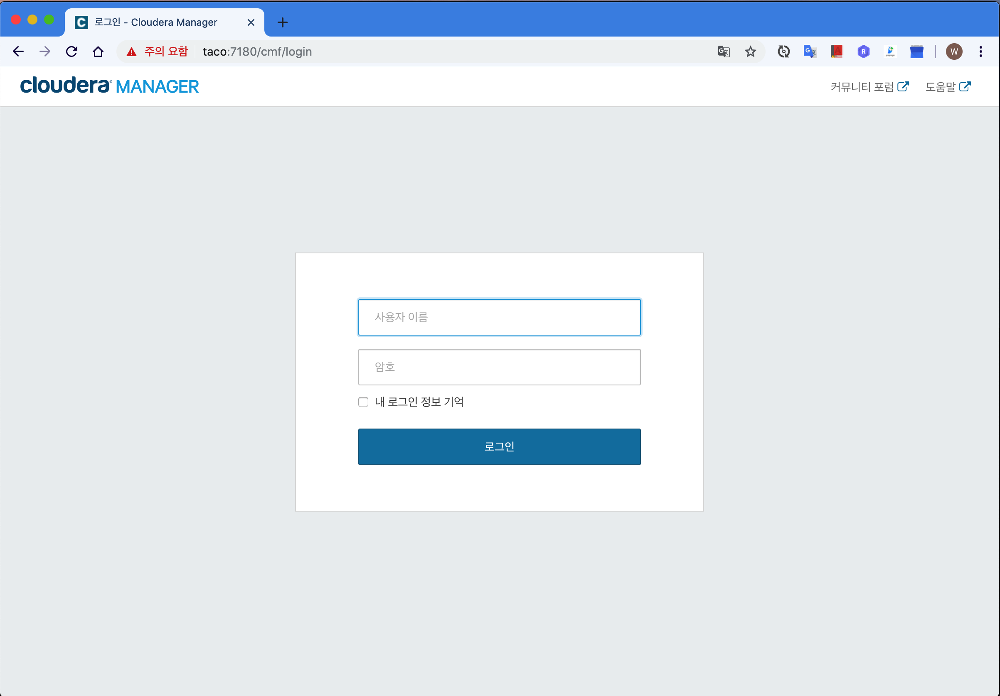

#### cloudera manager 버전 선택
👉 enterprise 버전으로 선택 (60일이 지나면 express버전으로 사용 가능)


#### Agent 호스트 검색
`taco burger pizza cookies` 입력
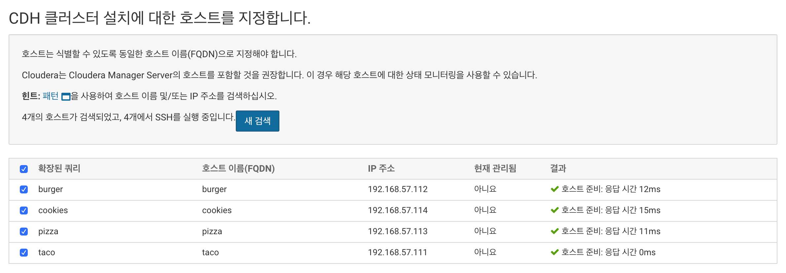

#### Parcel 선택
👉 Parcel을 사용하여 CDH(ver.5.16.1) 설치
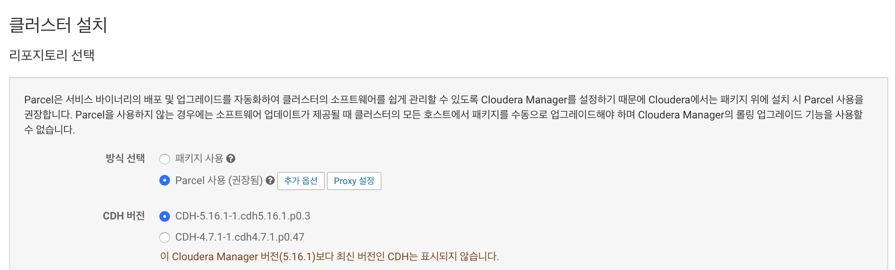

#### Agent Java 설치 여부 선택
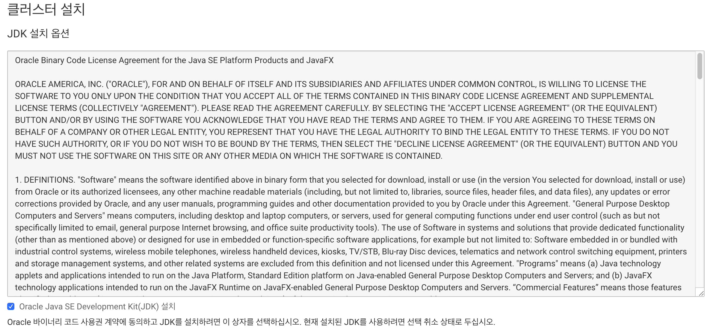

#### SSH 로그인 정보
👉 모든 서버들의 root계정 비밀번호는 동일하게 설정
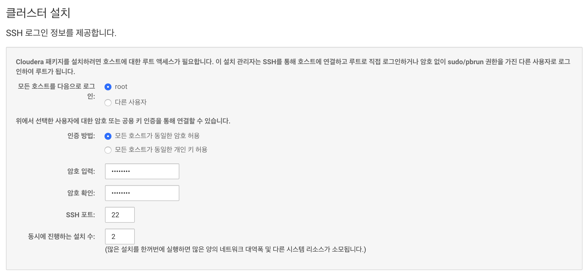

#### Install Agents
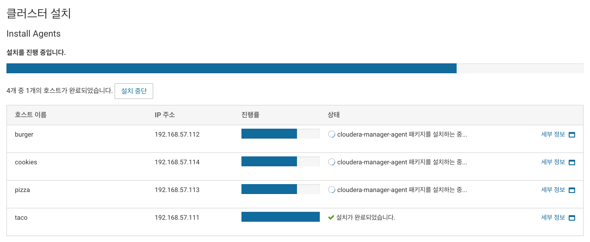

#### 선택한 Parcel 설치
이전 단계에서 선택한 Parcel을 설치 -> CDH(ver.5.16.1)를 다운로드하여 Agent들에게 배포 후 활성화 하는 작업
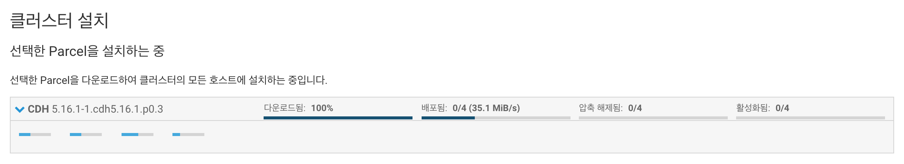

#### 호스트 정확성 검사


#### Select Service
👉 사용자 지정 서비스를 선택한 후 `HDFS`, `YARN`, `ZooKeeper` 선택
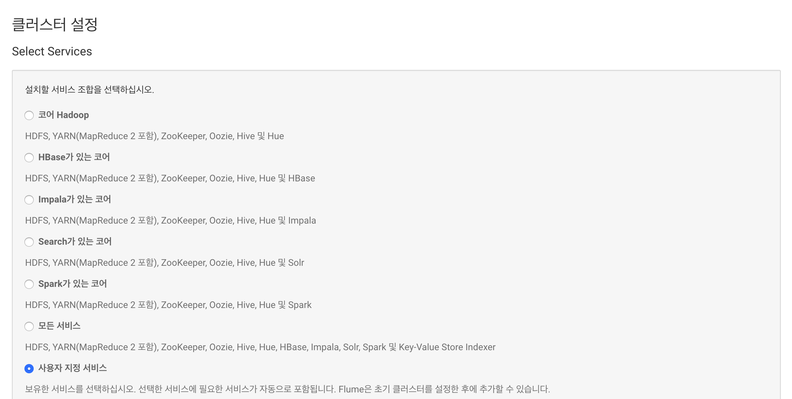


#### 역할 할당 사용자 지정
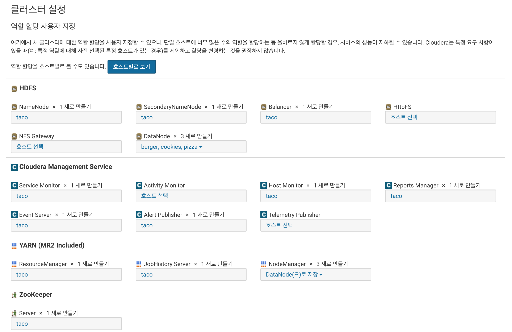
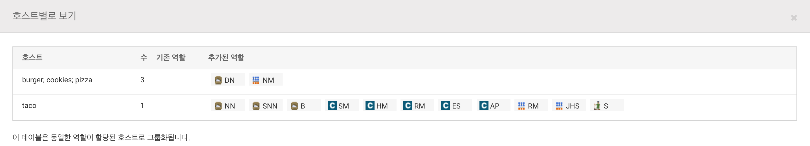

#### 데이터베이스 설정
👉 테스트 연결 클릭
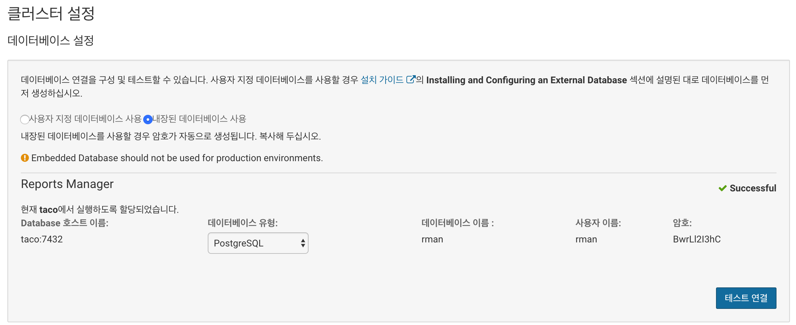

#### 변경내용 검토
Cluster들의 설정을 변경할 수 있는 페이지
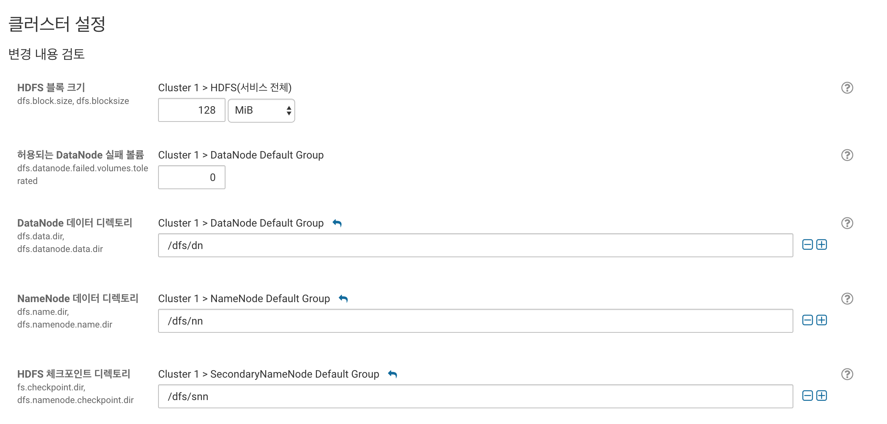

#### 실행
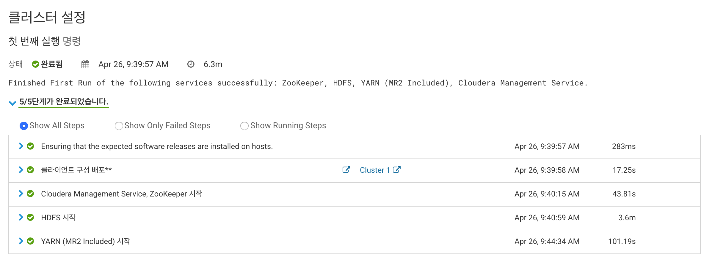


## Trouble Shooting
- cloudera-scm-server 로그 확인
    ```bash
    $> tail -f /var/log/cloudera-scm-server/cloudera-scm-server.log
    ```
-  cloudera-scm-server-db 로그 확인
    ```bash
    $> tail -f /var/log/cloudera-scm-server/db.log
    ```
- cloudera-scm-server-db 권한 문제로 실행 안될 경우
    ```bash
    $> chown -R cloudera-scm:cloudera-scm /var/lib/cloudera-scm-server-db/
    chmod 700 /var/lib/cloudera-scm-server-db/
    chmod 700 /var/lib/cloudera-scm-server-db/data
    ```
- Port 확인
    ```bash
    netstat -tulpn
    ```

# Hadoop Testing


## 참고자료
[Cloudera Manager — making Hadoop easy](https://www.cloudera.com/products/product-components/cloudera-manager.html)  
[Ports Used by Cloudera Manager and Cloudera Navigator](https://www.cloudera.com/documentation/enterprise/5-9-x/topics/cm_ig_ports_cm.html)  
[Installation | 5.5.x | Cloudera Documentation](https://www.cloudera.com/documentation/enterprise/5-5-x/topics/installation_installation.html)  
[Parcels | 5.5.x | Cloudera Documentation](https://www.cloudera.com/documentation/enterprise/5-5-x/topics/cm_ig_parcels.html)  
[virtual box centos6.7 환경에서 클라우데라 매니저 (cloudera manager)로 하둡 설치하기](https://lsjsj92.tistory.com/432)
