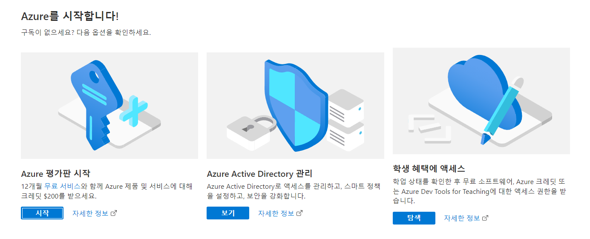
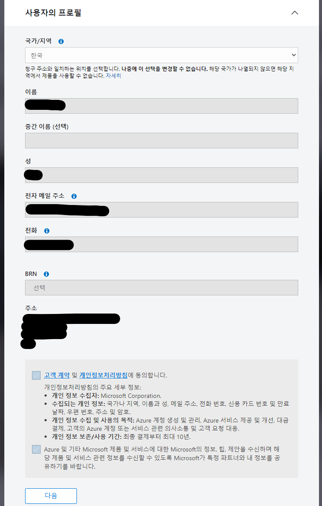
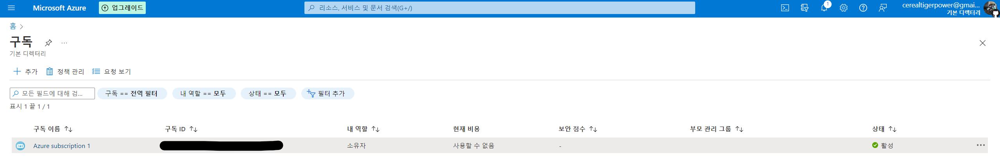
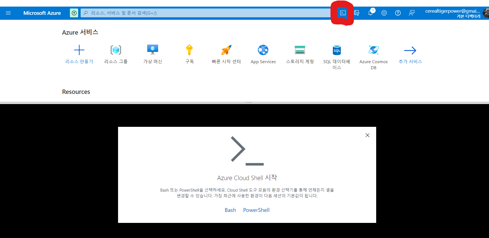

# Prerequisite

## 계정 및 구독 생성

- `https://portal.azure.com` 에 접속

  

- 사용자 프로필 등록

  
  

- 정상적으로 평가판 사용이 등록되었는지 구독을 먼저 확인해봐야 함  
  <u>**구독 ID는 복사하여 Azure CLI 설정 시 사용**</u>

  

## Azure CLI 설치

설치 가이드 👉 https://docs.microsoft.com/ko-kr/cli/azure/install-azure-cli

> Powershell 사용할 경우 👉 https://docs.microsoft.com/ko-kr/powershell/azure/install-az-ps
> WSL(Ubuntu) 사용 시 👉 https://docs.microsoft.com/ko-kr/cli/azure/install-azure-cli-linux?pivots=apt

> 저는 WSL에서 Azure CLI를 사용하도록 하겠습니다 ^^

## Azure Cloud Shell 사용



- Azure Cloud Shell 을 사용할 경우 Blob Storage 가 자동으로 생성됨

# VM 생성 및 삭제

## Azure Cli Login

```bash
$> SUBSCRIPTION=<구독 ID>

$> az login
$> az account set --subscription $SUBSCRIPTION
```

## Resource Group 생성

```bash
$> RESOURCE_GROUP=rg-myvm-trial-001
$> REGION=koreacentral

$> az group create --name $RESOURCE_GROUP --location $REGION
```

## Azure VM 생성

```bash
# 원하는 VM IMAGE 찾기 (OpenLogic:CentOS:7.5:latest)
$> IMAGE_NAME=$(az vm image list --query "[?publisher=='OpenLogic'].urn && [?contains(sku,'7.5')].urn" --output tsv | tr -d "\n\r")
$> VM_NAME=vm-mytest
$> ADMIN_USERNAME=myuser
# 비밀번호는 정해진 규칙을 지켜야 함 (qwer1234!@#$)
$> ADMIN_PASSWORD=qwer1234\!\@\#\$

$> az vm create --resource-group $RESOURCE_GROUP --name $VM_NAME --admin-username $ADMIN_USERNAME --admin-password $ADMIN_PASSWORD --authentication-type password --image $IMAGE_NAME
```

## Azure VM 접속

```bash
$> IP_ADDR=$(az vm show -d -g $RESOURCE_GROUP -n $VM_NAME --query publicIps -o tsv | tr -d "\n\r")
# 비밀번호 입력 후 로그인
$> ssh $ADMIN_USERNAME@$IP_ADDR
```

## Azure VM 삭제

```bash
$> az group delete --name $RESOURCE_GROUP
```

## 참고자료

https://docs.microsoft.com/ko-kr/azure/cloud-adoption-framework/ready/azure-best-practices/resource-naming

https://docs.microsoft.com/ko-kr/cli/azure/query-azure-cli

https://docs.microsoft.com/ko-kr/cli/azure/vm?view=azure-cli-latest
