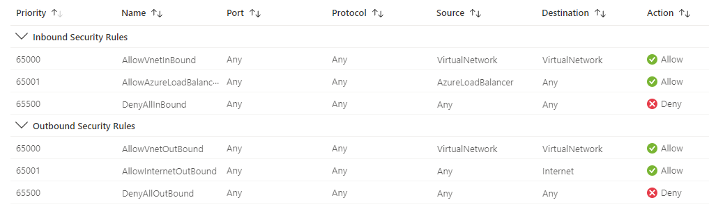
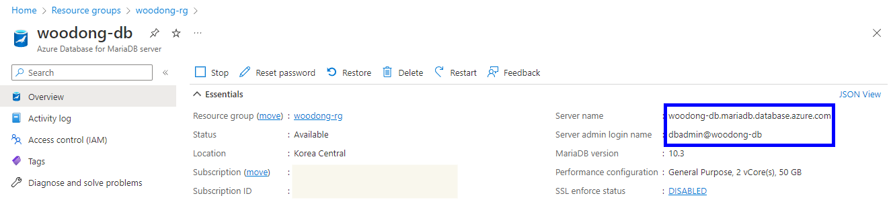
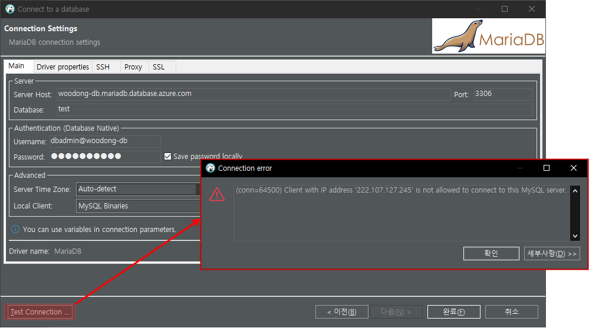
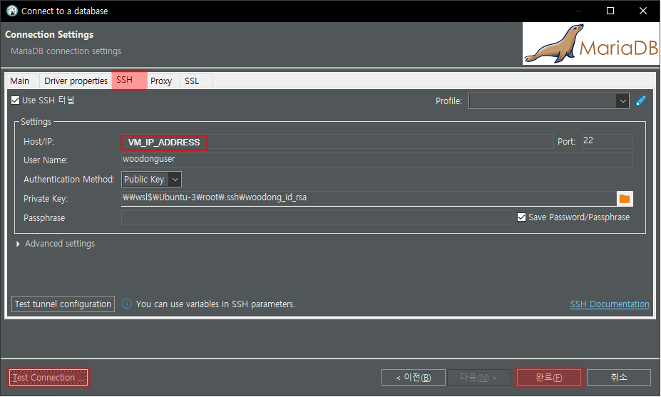

# Prerequisite

- 계정 및 구독 생성
- Azure CLI 설치 (윈도우 사용시 WSL 권장)
- Azure CLI 로그인
  ```bash
  $> SUBSCRIPTION=<구독 ID>
  $> az login
  $> az account set --subscription $SUBSCRIPTION
  ```

> [Azure Cloud 사용하기](https://wooyoung85.tistory.com/75) 참고

# 1. 리소스 그룹 생성

```bash
$> az group create --location koreacentral --name woodong-rg
```

# 2. 네트워크 구성

## 보안그룹

- 보안그룹 생성 시 기본적으로 모든 접근을 차단하게됨  
  
- Public 네트워크 보안 그룹에 내 IP 만 SSH 접속이 가능하도록 Rule 추가
- 내 IP는 https://www.myipaddress.com/ 에서 확인 가능

  ```bash
  $> MY_IP_ADDRESS=$(curl -s http://ipinfo.io/ip)

  # Public 네트워크 보안 그룹 생성
  $> az network nsg create --resource-group woodong-rg --name woodong-public-nsg
  $> az network nsg rule create --resource-group woodong-rg --nsg-name woodong-public-nsg --name AllowSSHConnect --priority 100 --source-address-prefixes $MY_IP_ADDRESS --destination-port-ranges 22 --access Allow --protocol Tcp --direction Inbound

  # Private 네트워크 보안 그룹 생성
  $> az network nsg create --resource-group woodong-rg --name woodong-private-nsg
  ```

## 가상네트워크

- 네트워크 주소공간 할당 규칙

  - Address space : `172.16.0.0/16`
  - Public Subnet : `172.16.1.0/24`
  - Private Subnet : `172.16.2.0/24`

  ```bash
  # 가상 네트워크 생성
  $> az network vnet create --resource-group woodong-rg --name woodong-vnet --address-prefix 172.16.0.0/16

  # Public Subnet 생성
  $> az network vnet subnet create --resource-group woodong-rg --vnet-name woodong-vnet --name woodong-public-subnet --address-prefixes 172.16.1.0/24 --network-security-group woodong-public-nsg

  # Private Subnet 생성
  $> az network vnet subnet create --resource-group woodong-rg --vnet-name woodong-vnet --name woodong-private-subnet --address-prefixes 172.16.2.0/24 --network-security-group woodong-private-nsg
  ```

## 네트워크 인터페이스

- Public Subnet 에 배포되는 VM이 인터넷과 통신하기 위한 목적

  ```bash
  # 공인 아이피 할당
  $> az network public-ip create --resource-group woodong-rg --name woodong-pupip --sku Standard --zone 2
  #  생성
  $> az network nic create -g woodong-rg --vnet-name woodong-vnet --subnet woodong-public-subnet --public-ip-address woodong-pupip -n woodong-nic
  ```

# 3. Virtual Machine 생성

## Virtual Machine

- VM Image 검색 (Ubuntu 20.04)
- Canonical:0001-com-ubuntu-server-focal:20_04-lts:20.04.202210180

  ```bash
  $> az vm image list -p canonical -o table --all | grep 20_04-lts | grep -v gen2
  ```

- 서버 접속 시 사용할 SSH Key 생성

  ```bash
  $> ssh-keygen -m PEM -t rsa -b 4096 -C "email@email.com" -f ~/.ssh/woodong_id_rsa
  $> cat ~/.ssh/woodong_id_rsa.pub
  ```

- VM Size : Standard_DS2_v2(vCPUs 2, Memory 7GiB)

  ```bash
  $> az vm create \
  --resource-group woodong-rg \
  --name woodong-vm \
  --image Canonical:0001-com-ubuntu-server-focal:20_04-lts:20.04.202210180 \
  --size Standard_DS2_v2 \
  --admin-username woodonguser \
  --public-ip-sku Standard \
  --ssh-key-values ~/.ssh/woodong_id_rsa.pub \
  --nics woodong-nic
  ```

- 서버 접속

  ```bash
  $> VM_IP_ADDR=$(az vm show --show-details --resource-group woodong-rg --name woodong-vm --query publicIps -o tsv | tr -d "\n\r")

  $> ssh -i ~/.ssh/woodong_id_rsa woodonguser@$VM_IP_ADDR

  woodonguser@woodong-vm> sudo apt-get -y update
  woodonguser@woodong-vm> sudo apt-get -y upgrade
  ```

- 사용자 추가

  ```bash
  woodonguser@woodong-vm> sudo adduser svruser
  # sudo 권한 추가
  woodonguser@woodong-vm> sudo usermod -aG sudo svruser
  ```

- SSH 접속 시 Password 인증 허용

  ```bash
  woodonguser@woodong-vm> sudo cat /etc/ssh/sshd_config.d/50-cloud-init.conf
  woodonguser@woodong-vm> sudo sed -i 's/no/yes/g' /etc/ssh/sshd_config.d/50-cloud-init.conf

  woodonguser@woodong-vm> sudo systemctl restart sshd
  ```

- MariaDB Client 설치

  ```bash
  woodonguser@woodong-vm> sudo apt-get install -y mariadb-client
  ```

# 4. 데이테베이스 생성

- MariaDB 10.3
- SKU : GP_Gen5_2 (General Purpose, Gen 5 hardware, 2 vCores)
  ```bash
  $> az mariadb server list-skus --location koreacentral -o table
  ```
- Public 접근 차단
- 백업보관기간 30일

  ```bash
  $> DB_PASSWORD=P@ssword1!

  $> az mariadb server create \
  --location koreacentral \
  --resource-group woodong-rg \
  --name woodong-db \
  --admin-user dbadmin \
  --admin-password $DB_PASSWORD \
  --sku-name GP_Gen5_2 \
  --ssl-enforcement Disabled \
  --public-network-access Disabled \
  --backup-retention 30 \
  --version 10.3
  ```

# 5. Private End Point 생성

- Private End Point를 통해 VM에서 접근 가능하도록 설정
- ~~CLI 보다 Portal 에서 설정하는게 더 편함~~

## Private End Point

```bash
$> DB_RESOURCE_ID=$(az resource show -g woodong-rg -n woodong-db --resource-type "Microsoft.DBforMariaDB/servers" --query "id" -o tsv | tr -d "\n\r")

$> az network private-endpoint create \
    --name woodong-db-pep \
    --resource-group woodong-rg \
    --vnet-name woodong-vnet  \
    --subnet woodong-private-subnet \
    --private-connection-resource-id $DB_RESOURCE_ID \
    --group-id mariadbServer \
    --connection-name woodong-db-conn
```

## Private DNS

```bash
$> az network private-dns zone create --resource-group woodong-rg --name "privatelink.mariadb.database.azure.com"
$> az network private-dns link vnet create --resource-group woodong-rg --zone-name "privatelink.mariadb.database.azure.com" --name woodong-db --virtual-network woodong-vnet --registration-enabled false

$> NETWORK_INTERFACE_ID=$(az network private-endpoint show --name woodong-db-pep --resource-group woodong-rg --query 'networkInterfaces[0].id' -o tsv | tr -d "\n\r")
$> PRIVATE_IP_ADDRESS=$(az resource show --ids $NETWORK_INTERFACE_ID  --query properties.ipConfigurations[0].properties.privateIPAddress -o tsv | tr -d "\n\r")

$> az network private-dns record-set a create --name woodong-db --zone-name privatelink.mariadb.database.azure.com --resource-group woodong-rg
$> az network private-dns record-set a add-record --record-set-name woodong-db --zone-name privatelink.mariadb.database.azure.com --resource-group woodong-rg -a $PRIVATE_IP_ADDRESS
```

# 6. DB 접속

## VM에서 접속

- 접속정보  
  

  ```bash
  $> ssh -i ~/.ssh/woodong_id_rsa woodonguser@$VM_IP_ADDR
  woodonguser@woodong-vm> mariadb -h woodong-db.mariadb.database.azure.com -u dbadmin@woodong-db -p
  MySQL> create database test;
  MySQL> show databases;
  ```

## 내 PC 에서 접속

- DBeaver의 SSH Tunnel 기능을 활용하여 접속

  

  

  > Password 로그인 방식으로 SSH Tunnel 설정도 가능

# 7. 리소스 그룹 삭제

```bash
$> az group delete --name woodong-rg
```

## 참고자료

[Azure Command-Line Interface (CLI) documentation](https://learn.microsoft.com/en-us/cli/azure/?view=azure-cli-latest)
[CLI를 사용하여 Azure Database for MariaDB의 프라이빗 링크 만들기 및 관리](https://learn.microsoft.com/ko-kr/azure/mariadb/howto-configure-privatelink-cli)
