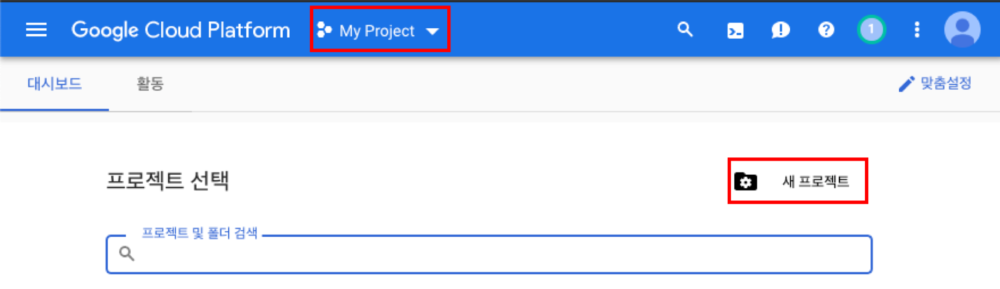
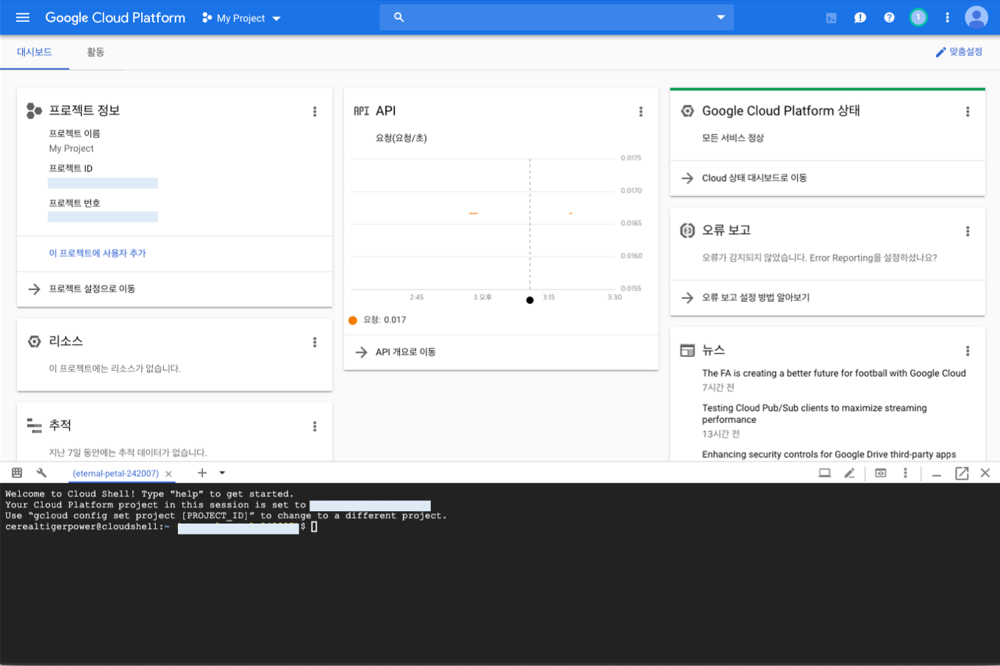

# Google Cloud Platform 사용하기

## 프로젝트 생성
VM 인스턴스를 생성하려면 프로젝트가 있어야 함


## cloud shell 활성화

- cloud shell 활성화한 후 프로젝트가 잘 설정되었는지 꼭 확인해야 함
- `gcloud config set project [PROJECT_ID]` 로 설정 가능  

## starup-script 준비
- VM 인스턴스를 생성하면 기본적으로 password를 통한 ssh 접속을 막아두고 있기 때문에 아래와 같이 설정하여 root 계정으로 ssh 접속을 하려고 함
- cloudshell에 `install.sh` 파일 생성 후 아래 내용 복사 붙여넣기 
    ```bash
    #!/bin/bash
    sudo yum -y install expect

    expect -c "set timeout 10
    spawn sudo passwd
    expect \"New password:\"
    send \"password\r\"
    expect \"Retype new password:\"
    send \"password\r\"
    expect eof"

    sudo sed -i 's/^PermitRootLogin .*/PermitRootLogin yes/' /etc/ssh/sshd_config
    sudo sed -i "s/^PasswordAuthentication .*/PasswordAuthentication yes/g" /etc/ssh/sshd_config

    sudo service sshd restart
    ```
    (**🙉주의사항 : 이 스크립트를 그대로 사용하면 root계정의 비밀번호는 password로 설정됨!!!**)

## VM 인스턴스 생성

```bash
gcloud compute instances create node2 node3 node4 node5 \
--zone=asia-northeast1-a \
--machine-type=n1-standard-1 \
--image-family=centos-6 \
--image-project=centos-cloud  \
--boot-disk-size=100GB \
--metadata-from-file startup-script=install.sh
```

```bash
gcloud compute instances create node1 \
--zone=asia-northeast1-a \
--custom-cpu=2 \
--custom-memory=12 \
--image-family=centos-6 \
--image-project=centos-cloud  \
--boot-disk-size=100GB \
--metadata-from-file startup-script=install.sh
```