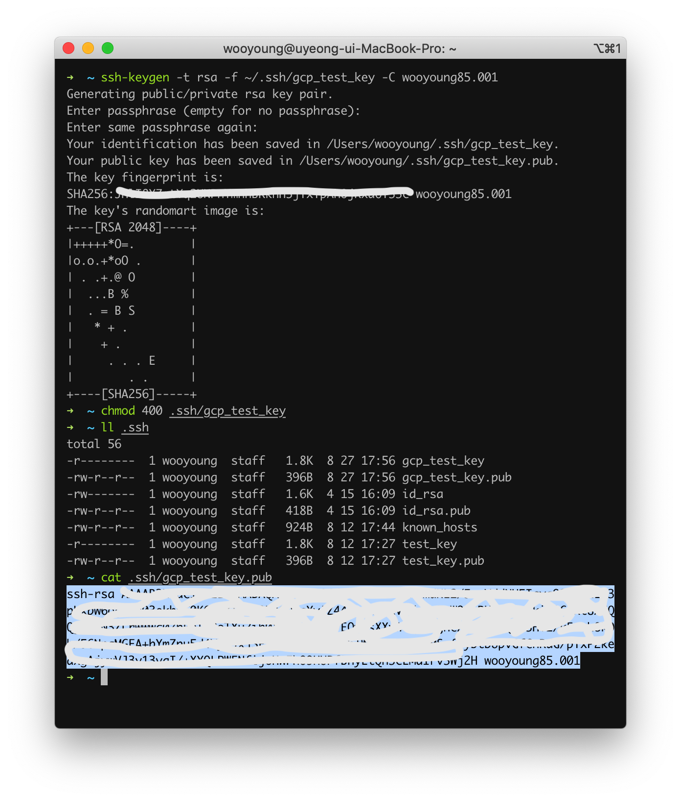
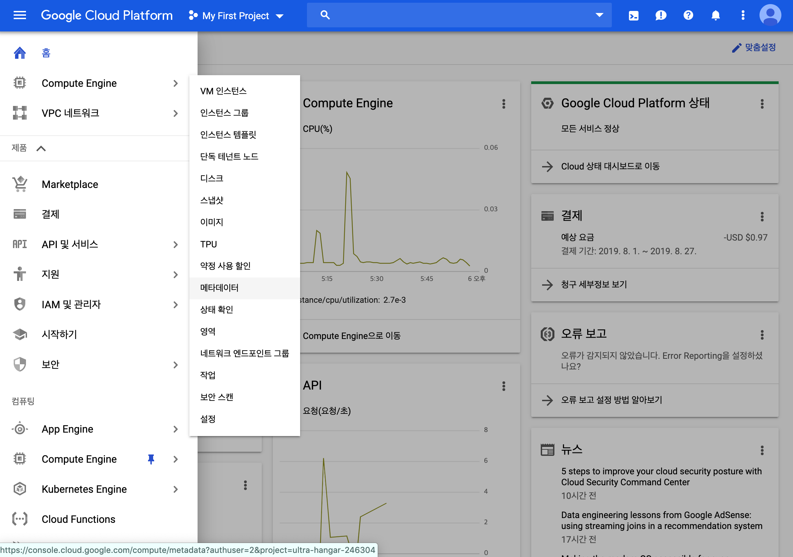
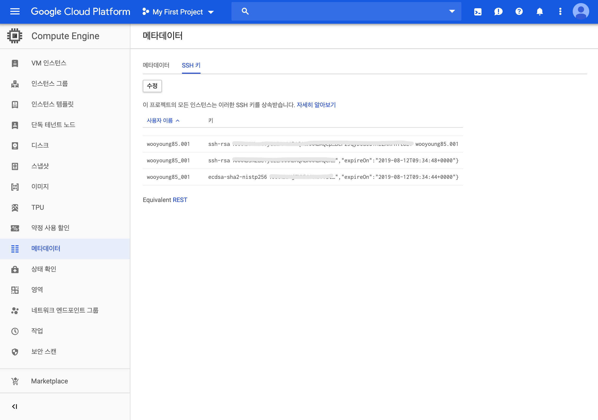
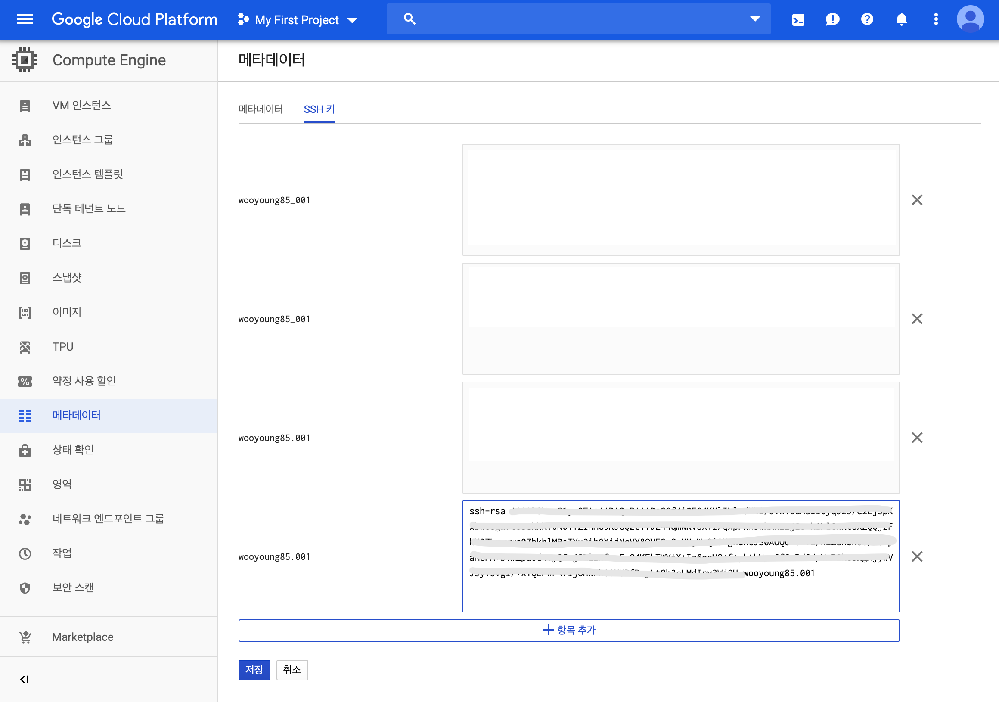
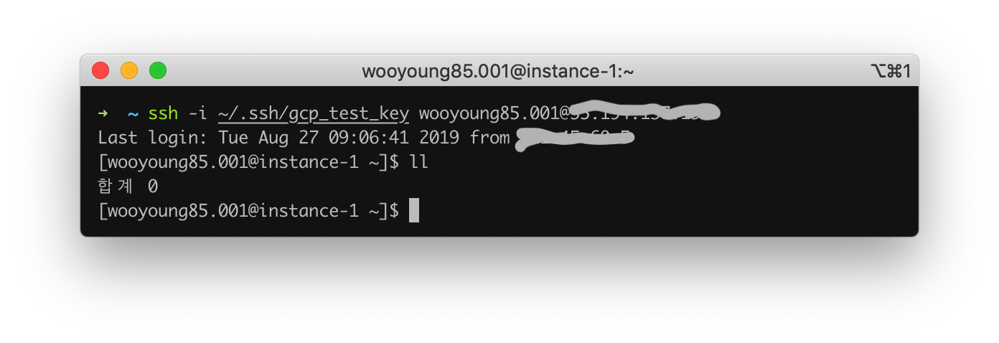

# Google Cloud Platform VM 접속하기

> Mac PC 기준으로 설명하겠습니다~

## key 생성

```bash
$> ssh-keygen -t rsa -f ~/.ssh/[KEY_FILENAME] -C [USERNAME]
# 자신만 private 키를 읽을 수 있도록 설정
$> chmod 400 ~/.ssh/[KEY_FILENAME]
```

- **[KEY_FILENAME]** : SSH Key 파일에 사용하려는 이름  
  예를 들어, 파일 이름이 my-ssh-key이면 이름이 my-ssh-key인 Private Key 파일을 생성하고 이름이 my-ssh-key.pub인 Public Key 파일을 생성함
- **[USERNAME]** : 인스턴스에 연결하는 사용자의 사용자 이름 (👉google 계정)
  

## 메타데이터 등록

- `Compute Engine > 메타데이터` 메뉴로 이동
  
- `SSH 키` 탭으로 이동
  
- Public Key 등록
  

## Instance 접속

```bash
$> ssh -i ~/.ssh/[KEY_FILENAME] [USERNAME]@[Instance Public IP]
```



## 참고자료

[gcloud compute instances create | Cloud SDK](https://cloud.google.com/sdk/gcloud/reference/compute/instances/create)  
[메타데이터에서 SSH 키 관리 | Compute Engine 문서](https://cloud.google.com/compute/docs/instances/adding-removing-ssh-keys?hl=ko)  
[인스턴스에 연결 | Compute Engine 문서](https://cloud.google.com/compute/docs/instances/connecting-to-instance?hl=ko)
