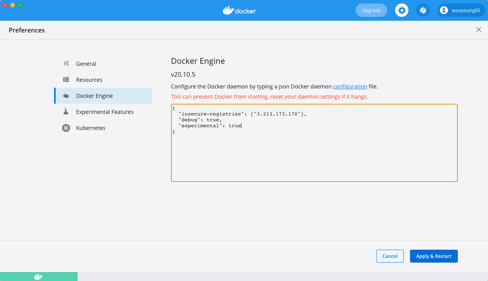

# Minikube Trouble Shooting

> Minikube 환경에서 Istio 실습을 진행하면서 겪은 에러 발생 상황입니다

## 문제상황
- 😫 ErrImagePull 에러 발생 

    ```bash
    $> kubectl get pods -n istio-system

    NAME                                    READY   STATUS         RESTARTS   AGE
    grafana-784c89f4cf-9gnjm                1/1     Running        0          5m43s
    istio-egressgateway-8dff9c778-xfqmt     1/1     Running        0          5m44s
    istio-ingressgateway-6cfd75fc57-qprqg   1/1     Running        0          5m44s
    istiod-665965d9c4-hrcc8                 1/1     Running        0          5m44s
    jaeger-7f78b6fb65-9bh99                 1/1     Running        0          5m43s
    kiali-59bb6c656b-9r46s                  0/1     ErrImagePull   0          7s
    prometheus-7bfddb8dbf-vwlq6             2/2     Running        0          5m43s
    ```

- 좀 더 자세히 살펴보니 `kiali:v1.23` 이미지를 받는 과정에서  `quay.io` 에 접속이 잘 안 되는 듯
  ```bash
  $> kubectl describe pods -n istio-system kiali-59bb6c656b-9r46s
    Name:         kiali-59bb6c656b-9r46s
    Namespace:    istio-system
    Priority:     0
    Node:         minikube/192.168.49.2
    Start Time:   Wed, 31 Mar 2021 17:40:53 +0900
    Labels:       app=kiali
                app.kubernetes.io/instance=kiali-server
                app.kubernetes.io/managed-by=Helm
                app.kubernetes.io/name=kiali
                app.kubernetes.io/version=v1.26.0
                helm.sh/chart=kiali-server-1.26.0
                pod-template-hash=59bb6c656b
                version=v1.26.0
    Annotations:  kiali.io/runtimes: go,kiali
                prometheus.io/port: 9090
                prometheus.io/scrape: true
                sidecar.istio.io/inject: false
    Status:       Pending
    IP:           172.17.0.9
    IPs:
    IP:           172.17.0.9
    Controlled By:  ReplicaSet/kiali-59bb6c656b
    Containers:
    kiali:
        Container ID:
        Image:         quay.io/kiali/kiali:v1.23
        Image ID:
        Ports:         20001/TCP, 9090/TCP
        Host Ports:    0/TCP, 0/TCP
        Command:
        /opt/kiali/kiali
        -config
        /kiali-configuration/config.yaml
        State:          Waiting
        Reason:       ErrImagePull
        Ready:          False
        Restart Count:  0
        Liveness:       http-get http://:api-port/kiali/healthz delay=5s timeout=1s period=30s #success=1 #failure=3
        Readiness:      http-get http://:api-port/kiali/healthz delay=5s timeout=1s period=30s #success=1 #failure=3
        Environment:
        ACTIVE_NAMESPACE:  istio-system (v1:metadata.namespace)
        Mounts:
        /kiali-cert from kiali-cert (rw)
        /kiali-configuration from kiali-configuration (rw)
        /kiali-secret from kiali-secret (rw)
        /var/run/secrets/kubernetes.io/serviceaccount from kiali-token-7zmzq (ro)
    Conditions:
    Type              Status
    Initialized       True
    Ready             False
    ContainersReady   False
    PodScheduled      True
    Volumes:
    kiali-configuration:
        Type:      ConfigMap (a volume populated by a ConfigMap)
        Name:      kiali
        Optional:  false
    kiali-cert:
        Type:        Secret (a volume populated by a Secret)
        SecretName:  istio.kiali-service-account
        Optional:    true
    kiali-secret:
        Type:        Secret (a volume populated by a Secret)
        SecretName:  kiali
        Optional:    true
    kiali-token-7zmzq:
        Type:        Secret (a volume populated by a Secret)
        SecretName:  kiali-token-7zmzq
        Optional:    false
    QoS Class:       BestEffort
    Node-Selectors:  <none>
    Tolerations:     node.kubernetes.io/not-ready:NoExecute op=Exists for 300s
                    node.kubernetes.io/unreachable:NoExecute op=Exists for 300s
    Events:
    Type     Reason     Age                From               Message
    ----     ------     ----               ----               -------
    Normal   Scheduled  30s                default-scheduler  Successfully assigned istio-system/kiali-59bb6c656b-9r46s to minikube
    Normal   Pulling    15s (x2 over 30s)  kubelet            Pulling image "quay.io/kiali/kiali:v1.23"
    Warning  Failed     15s (x2 over 29s)  kubelet            Failed to pull image "quay.io/kiali/kiali:v1.23": rpc error: code = Unknown desc = Error response from daemon: Get https://quay.io/v2/: x509: certificate signed by unknown authority
    Warning  Failed     15s (x2 over 29s)  kubelet            Error: ErrImagePull
    Normal   BackOff    3s (x2 over 29s)   kubelet            Back-off pulling image "quay.io/kiali/kiali:v1.23"
    Warning  Failed     3s (x2 over 29s)   kubelet            Error: ImagePullBackOff
  ```

## 해결방법
검색을 해보니 2가지 가능성이 검토되었다.

1. Proxy 나 VPN을 사용하는 경우
   - [freepsw님의 블로그 - [minikube] x509: certificate signed by unknown authority](https://m.blog.naver.com/freepsw/221998687392) 에 잘 정리되어 있음
   - Proxy 를 사용하고 있는 네트워크 환경은 아니었기 때문에 이 문제는 아닐꺼라고 판단

2. 사설 레지스트리
   - Minikube 에서 `quay.io` 레지스트리를 인식하지 못하는 문제였음
   - Minikube start 할 때 `insecure-registry` 옵션을 사용하여 등록
        ```bash
        $> minikube start --insecure-registry="quay.io"
        ```
> 추가로 Docker Engine 에 insecure-registry 등록하는 방법
> 


## 참고문서
[minikube - x509: certificate signed by unknown authority](https://stackoverflow.com/questions/64532470/minikube-x509-certificate-signed-by-unknown-authority)