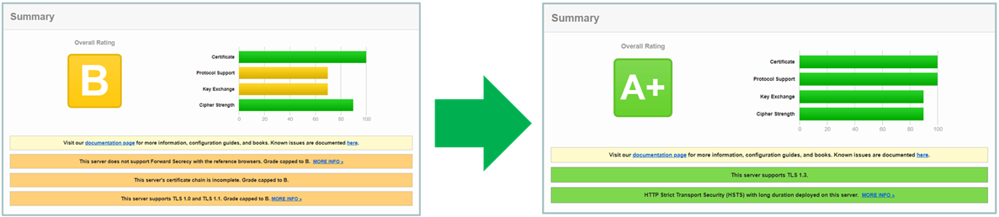

<style>
  .message-box{
    width: 94%;
    background-color:#e6eaf0;
    padding: 5px 10px 0px 10px;
    margin-left: -5px;
    vertical-align: middle;
  }
  .message-box p{
    font-weight: 800;
    color: black
  }
</style>

> SSL 1.3버전으로 업그레이드 하는게 생가보다 까다로웠습니다 😐  
> 인증서 문제인가???😨 nginx 설정 문제인가??😨 머가 문제인지 정확하게 몰라서 엄청 헤맸네요...~~아까운 내시간 ㅠㅠ~~

## 배경지식

- SSL 및 TLS 버전은 OS/웹서버/웹브라우저에서 자체 지원하는 기능이고 인증서와는 전혀 관계가 없음  
  (네트워크 암호화 프로토콜 ≠ 인증서)
- Linux 계열 시스템들은 openssl을 사용하게 되고, TLS 1.3은 openssl 1.1 이상 버전에서 지원됨
- CentOS 7에서는 yum 패키지매니저로 openssl 1.1 버전 설치 불가
- 수동으로 openssl 버전 업데이트 해야만 함  
  (소스를 다운받고 컴파일/설치/동적링크 생성하는 작업)

## SSL 1.3 버전 적용여부 확인

#### openssl 명령어

```bash
$> openssl s_client -connect sgstatsdemo.seegene.com:443 -tls1_3
CONNECTED(00000003)
139905902826816:error:14094410:SSL routines:ssl3_read_bytes:sslv3 alert handshake failure:../ssl/record/rec_layer_s3.c:1543:SSL alert number 40
---
no peer certificate available
---
No client certificate CA names sent
---
SSL handshake has read 7 bytes and written 243 bytes
Verification: OK
---
New, (NONE), Cipher is (NONE)
Secure Renegotiation IS NOT supported
Compression: NONE
Expansion: NONE
No ALPN negotiated
Early data was not sent
Verify return code: 0 (ok)
```

> 딱 봐도 알겠지만 이런식으로 나오면 적용이 안된 것

#### SSL Lab

- https://www.ssllabs.com/ssltest
- SSL 관련 웹 서버 설정이 잘 적용되었는지 확인하는 사이트
- 미리보는 작업결과
  

## 작업순서

> **🚫❗ 충분한 내용 이해와 연습 없이 서버에서 바로 작업하게되면 상당히 리스크가 있는 작업입니다. 주의하시기 바랍니다~!!**

> 제가 사용중인 환경 (OS : CentOS 7.5, 웹서버 : Nginx)

0. 관리자 권한 획득
1. Open SSL 업그레이드 (with 컴파일)
2. NginX 재설치 (with 컴파일)
3. NginX 설정 변경

### 관리자 권한 획득

```bash
$> sudo su
```

### Open SSL 업그레이드

```bash
# openssl 현재 버전 확인
$> openssl version
OpenSSL 1.0.2k-fips  26 Jan 2017

# OpenSSL 지원 프로토콜 확인
$> openssl ciphers -v | awk '{print $2}' | sort | uniq
SSLv3
TLSv1.2

# 필요한 라이브러리 설치
$> yum -y install gcc gcc-c++ perl pcre-devel zlib-devel wget

# 소스 다운로드 및 컴파일
$> cd /usr/src
$> wget https://www.openssl.org/source/openssl-1.1.1l.tar.gz --no-check-certificate
$> tar xvfz openssl-1.1.1l.tar.gz
$> cd openssl-1.1.1l/
## Makefile 생성 (prefix는 상황에 맞게 설정)
$> ./config --prefix=/usr/local/ssl --openssldir=/usr/local/ssl shared zlib
## 꽤 오래걸림
$> make -j `grep processor /proc/cpuinfo | wc -l`
$> make install

# 기존 openssl 이름 변경
$> mv /usr/bin/openssl /usr/bin/openssl1.0.2k

# 라이브러리 등록 및 링크 생성
$> echo "/usr/local/ssl/lib" > /etc/ld.so.conf.d/openssl-1.1.1l.conf
$> ldconfig
$> ln -s /usr/local/ssl/bin/openssl /usr/bin/openssl

# 업데이트된 버전 확인
$> openssl version
OpenSSL 1.1.1l  24 Aug 2021

# OpenSSL 지원 프로토콜 확인
## 신규 버전 openssl
$> openssl ciphers -v | awk '{print $2}' | sort | uniq
SSLv3
TLSv1
TLSv1.2
TLSv1.3
## 기존 버전 openssl
$> openssl1.0.2k ciphers -v | awk '{print $2}' | sort | uniq
SSLv3
TLSv1.2
```

### NginX 재설치

```bash
# 기존 nginx 설정 백업
$> cp /etc/nginx /tmp/.

# nginx 서비스 중지 및 삭제
$> systemctl stop nginx
$> yum remove -y nginx

# 소스 다운로드 및 컴파일
$> cd /tmp
$> wget https://nginx.org/download/nginx-1.20.2.tar.gz
$> tar xvfz nginx-1.20.2.tar.gz
## nginx 사용자가 있을 경우 패스해도 됨
$> useradd nginx
useradd: user 'nginx' already exists
$> cd nginx-1.20.2/
## Makefile 생성 (prefix는 상황에 맞게 설정, config argument는 상황에 맞게 추가 및 삭제)
## --with-openssl 경로는 다운받은 openssl 소스코드 경로
$> ./configure --prefix=/etc/nginx \
--sbin-path=/usr/sbin/nginx \
--modules-path=/usr/lib64/nginx/modules  \
--conf-path=/etc/nginx/nginx.conf \
--error-log-path=/var/log/nginx/error.log \
--http-log-path=/var/log/nginx/access.log \
--pid-path=/var/run/nginx.pid \
--lock-path=/var/run/nginx.lock \
--http-client-body-temp-path=/var/cache/nginx/client_temp \
--http-proxy-temp-path=/var/cache/nginx/proxy_temp \
--http-fastcgi-temp-path=/var/cache/nginx/fastcgi_temp \
--http-uwsgi-temp-path=/var/cache/nginx/uwsgi_temp \
--http-scgi-temp-path=/var/cache/nginx/scgi_temp \
--user=nginx \
--group=nginx \
--with-compat \
--with-file-aio \
--with-threads \
--with-http_addition_module \
--with-http_auth_request_module \
--with-http_dav_module \
--with-http_flv_module \
--with-http_gunzip_module \
--with-http_gzip_static_module \
--with-http_mp4_module \
--with-http_random_index_module \
--with-http_realip_module \
--with-http_secure_link_module \
--with-http_slice_module \
--with-http_ssl_module \
--with-http_stub_status_module \
--with-http_sub_module \
--with-http_v2_module \
--with-mail \
--with-mail_ssl_module \
--with-stream \
--with-stream_realip_module \
--with-stream_ssl_module \
--with-stream_ssl_preread_module \
--with-openssl=/usr/src/openssl-1.1.1l
## 꽤 오래걸림
$> make -j `grep processor /proc/cpuinfo | wc -l`
$> make install

# nginx 버전 확인
$> nginx -V
nginx version: nginx/1.20.2
built by gcc 4.8.5 20150623 (Red Hat 4.8.5-44) (GCC)
built with OpenSSL 1.1.1l  24 Aug 2021
TLS SNI support enabled
configure arguments: --prefix=/etc/nginx --sbin-path=/usr/sbin/nginx --modules-path=/usr/lib64/nginx/modules --conf-path=/etc/nginx/nginx.conf --error-log-path=/var/log/nginx/error.log --http-log-path=/var/log/nginx/access.log --pid-path=/var/run/nginx.pid --lock-path=/var/run/nginx.lock --http-client-body-temp-path=/var/cache/nginx/client_temp --http-proxy-temp-path=/var/cache/nginx/proxy_temp --http-fastcgi-temp-path=/var/cache/nginx/fastcgi_temp --http-uwsgi-temp-path=/var/cache/nginx/uwsgi_temp --http-scgi-temp-path=/var/cache/nginx/scgi_temp --user=nginx --group=nginx --with-compat --with-file-aio --with-threads --with-http_addition_module --with-http_auth_request_module --with-http_dav_module --with-http_flv_module --with-http_gunzip_module --with-http_gzip_static_module --with-http_mp4_module --with-http_random_index_module --with-http_realip_module --with-http_secure_link_module --with-http_slice_module --with-http_ssl_module --with-http_stub_status_module --with-http_sub_module --with-http_v2_module --with-mail --with-mail_ssl_module --with-stream --with-stream_realip_module --with-stream_ssl_module --with-stream_ssl_preread_module --with-openssl=/usr/src/openssl-1.1.1l

# 기존 설정 파일 복사
$> rm -rf /etc/nginx
$> cp /tmp/nginx /etc/.

# nginx 서비스 등록 및 시작
$> cat <<EOF > /etc/systemd/system/nginx.service
[Unit]
Description=The NGINX HTTP and reverse proxy server
After=syslog.target network.target remote-fs.target nss-lookup.target

[Service]
Type=forking
PIDFile=/var/run/nginx.pid
ExecStartPre=/usr/sbin/nginx -t
ExecStart=/usr/sbin/nginx
ExecReload=/usr/sbin/nginx -s reload
ExecStop=/bin/kill -s QUIT $MAINPID
PrivateTmp=true

[Install]
WantedBy=multi-user.target

EOF

$> systemctl daemon-reload
$> systemctl start nginx
$> systemctl status nginx
$> systemctl enable nginx
```

### NginX 설정 변경

> server 항목 위에 써야 함

```conf
ssl_protocols TLSv1.2 TLSv1.3;

ssl_prefer_server_ciphers off;

ssl_ciphers ECDHE-ECDSA-AES128-GCM-SHA256:ECDHE-RSA-AES128-GCM-SHA256:ECDHE-ECDSA-AES256-GCM-SHA384:ECDHE-RSA-AES256-GCM-SHA384:ECDHE-ECDSA-CHACHA20-POLY1305:ECDHE-RSA-CHACHA20-POLY1305:DHE-RSA-AES128-GCM-SHA256:DHE-RSA-AES256-GCM-SHA384;

ssl_ecdh_curve secp384r1;
ssl_session_cache shared:SSL:10m;
ssl_session_tickets off;
ssl_stapling on;
ssl_stapling_verify on;

resolver_timeout 5s;

add_header Strict-Transport-Security "max-age=63072000" always;

add_header X-Frame-Options SAMEORIGIN;
add_header X-Content-Type-Options nosniff;

server {
  (...)
}
```

## Trouble Shooting

<div class="message-box">
<p>This server does not support Forward Secrecy with the reference browsers. Grade capped to B</p>
</div>

- 모든 작업을 마치고 SSL Lab에서 다시 검사를 했는데 위와 같은 메세지가 보이면서 등급이 계속 B로 나옴 ㅠㅠ
- 인증서를 제대로 적용하지 않아서 발생한 문제

- 전달받은 인증서 파일
  ```bash
  -rw-r--r--. 1 root root 2175 Nov 17 11:26 STAR.example.com.crt
  -rw-r--r--. 1 root root 1732 Nov 17 11:26 STAR.example.com.key
  -rw-r--r--. 1 root root 5571 Nov 17 11:26 ca-bundle.crt
  ```
- Chain 인증서를 만들어서 적용해야 함
  ```bash
  $> cat STAR.example.com.crt ca-bundle.crt > STAR.example.com.chained.crt
  ```

## 참고자료

[nginx tls 1.3 enable / php-fpm ( nginx 1.17.8 / php 7.3.14)](https://xinet.kr/?p=2765)  
[nginx 웹 서버 ssl labs 고득점 받기](https://www.lesstif.com/system-admin/nginx-ssl-labs-95880245.html)  
[Configuring HTTPS servers - SSL certificate chains](http://nginx.org/en/docs/http/configuring_https_servers.html#chains)  
[Session cache not detected in nginx](https://stackoverflow.com/questions/22732045/session-cache-not-detected-in-nginx)
