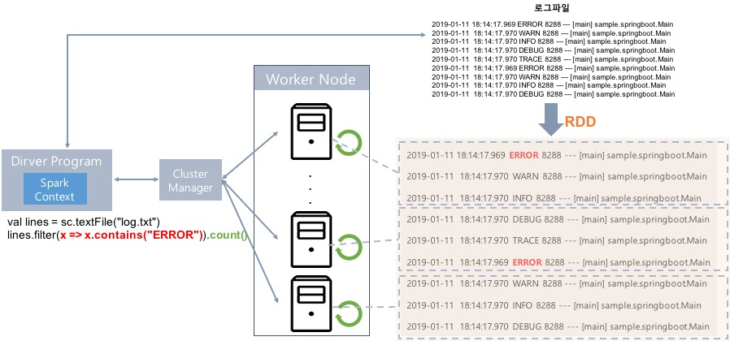
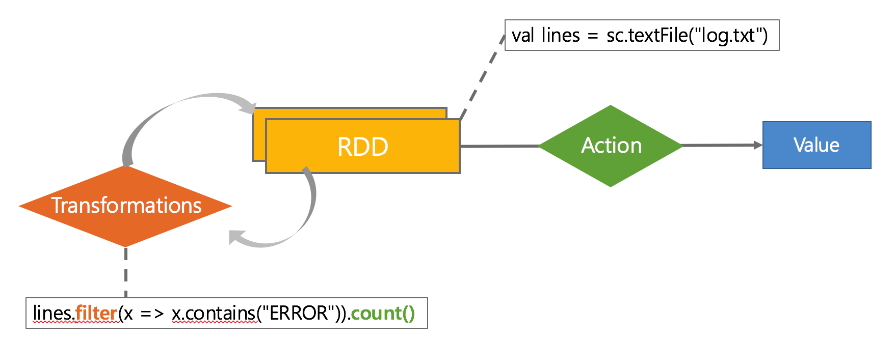

# RDD (Resilient Distributed Dataset)

- **Dataset**
메모리나 디스크에 분산 저장된 변경 불가능한 데이터 객체들의 모음
- **Distributed**
RDD에 있는 데이터는 클러스터에 자동 분배 및 병렬 연산 수행
- **Resilient**
클러스터의 한 노드가 실패하더라도 다른 노드가 작업처리(fail over)
- **Immutable**
수정 X, 수정하려면 새로운 RDD 생성해야 함

## RDD Operation APIs
- Transformations(데이터 변형)
`map,filter, groupBy, join`
- Actions(연산결과 리턴 or 저장)
`count, collect, save`

## Lazy Execution
> 실제 Action이 Call될 때 작업이 수행됨

## Caching 및 Persistence
> RAM/Disk에 캐시 가능, 중간 단계 결과를 저장해서 후속 연산에 사용가능하기 때문에 반복 연산에 유리


## Spark 언어 지원

- <b>Standalone Programs</b> : Scala, Java, Python, R
- <b>Interactive Shells</b> : Scala, Python, R
- <b>Performance</b> : Java > Scala > Python

```scala
//Scala
val lines = sc.textFile("log.txt")
lines.filter(x => x.contains("ERROR")).count()
```

```java
//Java
JavaRDD<String> lines = sc.textFile("log.txt");
lines.filter(new Function<String, Boolean>(){
    Boolean call(String x){
      return x.contains("ERROR");
  }
}).count();
```
```python
#Python
lines = sc.textFile("log.txt")
lines.filter(lambda x: "ERROR" in x).count()
```

# Spark Program Architecture (로그 분석 프로그램)
<center></center>

<center></center>


# Spark-Shell 사용하기
## Scala용 Spark-Shell 실행
```shell
$> cd /tcl/spark-2.4.0-bin-hadoop2.7
$> bin/spark-shell

scala> sc
scala> spark
scala> sc.master
```
## SparkSubmit 프로세스 확인
- jar로 패키징 한 파일 실행
```shell 
$> jps
```

## 드라이버 프로그램용 웹 UI 확인
http://192.168.56.XXX:4040

## RDD 생성
```shell
scala> val data = 1 to 10000
scala> val distData = sc.parallelize(data)
scala> distData.filter(_ < 10).collect()
```
> (클러스터의 코어 수에 따라) 정해진 파티션 수만큼 새로운 RDD가 작성되고, 콜렉션의 요소가 RDD로 복사됨

## Lazy Execution
```shell
scala> val data = sc.textFile("README.txt") # 잘못된 파일명
scala> val distData = data.map(r => r + "_map")
scala> distData.count # InvalidInputException 발생

scala> val data = sc.textFile("README.md") # 파일명 수정
scala> val distData = data.map(r => r + "_map")
scala> distData.count
```

## Lineage 확인, Partition 개수 확인
- Lineage : RDD로 만들어지는 과정이 기록된 계보
- Partition : a logical chunk of a large data set
```shell
scala> distData.toDebugString
scala> distData.getNumPartitions
```

## Shuffle by Repartition
```shell
scala> val data = sc.textFile("README.md") 
scala> data.getNumPartitions
scala> val distData = data.map(r => "line_start : " + r)
scala> distData.getNumPartitions # 파티션 개수 변화 없음
scala> val newData = distData.repartition(10)
scala> newData.getNumPartitions # 파티션 개수 변경됨
scala> newData.toDebugString # Lineage 확인
scala> newData.count
scala> newData.collect.foreach(println)

# Partition 별로 원본 파일 내용 유지되어 있음
scala> data.saveAsTextFile("dataREADME.md")
# Partition 별로 원본 파일 내용 섞여 있음
scala> newData.saveAsTextFile("newData")
```

## Word Count
```shell
scala> val f = sc.textFile("README.md")
scala> val wc = f.flatMap(l => l.split(" ")).map(word => (word, 1)).reduceByKey(_ + _)
scala> wc.saveAsTextFile("wc_out.txt")
scala> wc.collect.foreach(println) # Stage Skip 확인
```

## Shuffle
> 데이터를 집계, 조인 또는 다른 방식으로 분산시키기 위해 <b>파티션 간에 데이터를 재분배</b>하는 프로세스
- partition 수 변경, reduceByKey 등을 사용할 경우 Shuffle이 일어남
- local file-system에 중간 결과물 저장
- 중간 결과물 파티셔닝 (repartitioning)
- Serialization/Deserialization, Network I/O


## 참고 사이트
[Overview - Spark 2.4.3 Documentation](https://spark.apache.org/docs/latest/)  
[Spark Tutorial – Learn Spark Programming](https://data-flair.training/blogs/spark-tutorial/)
