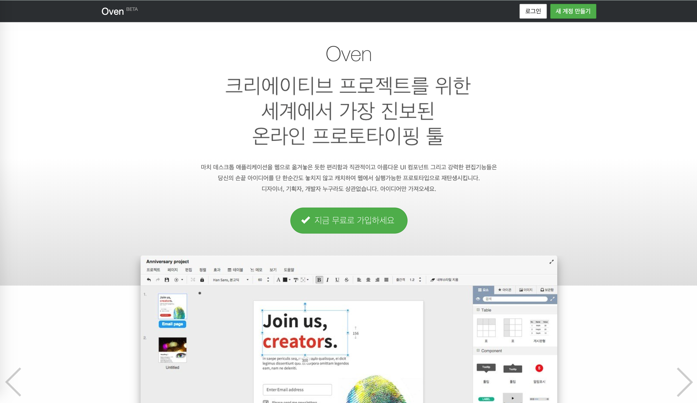
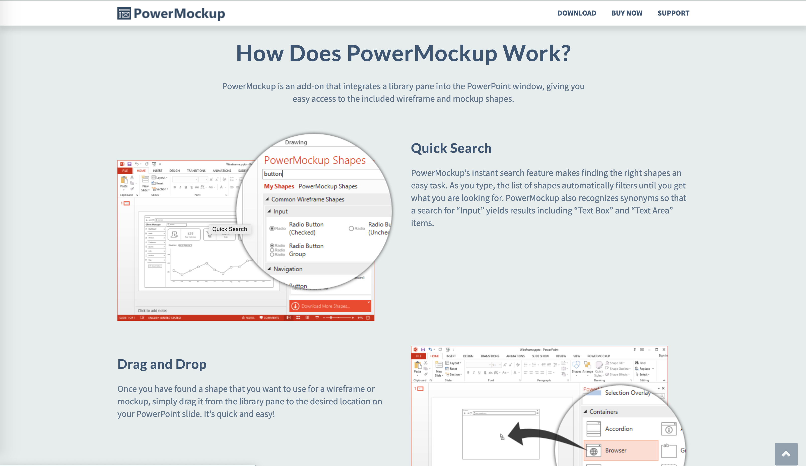
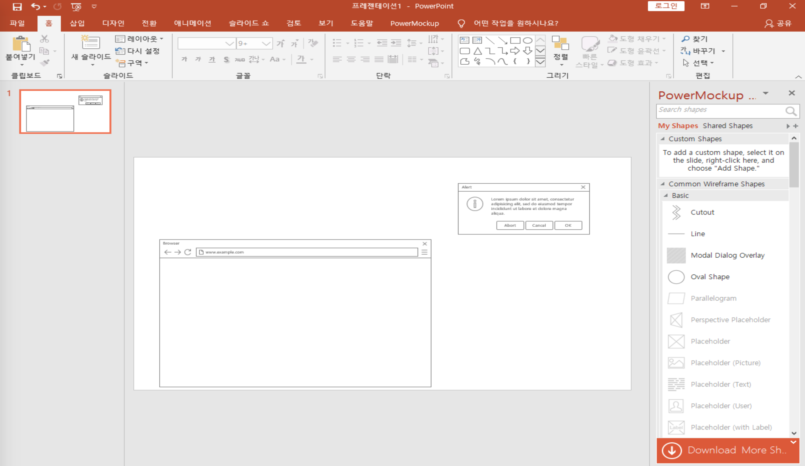
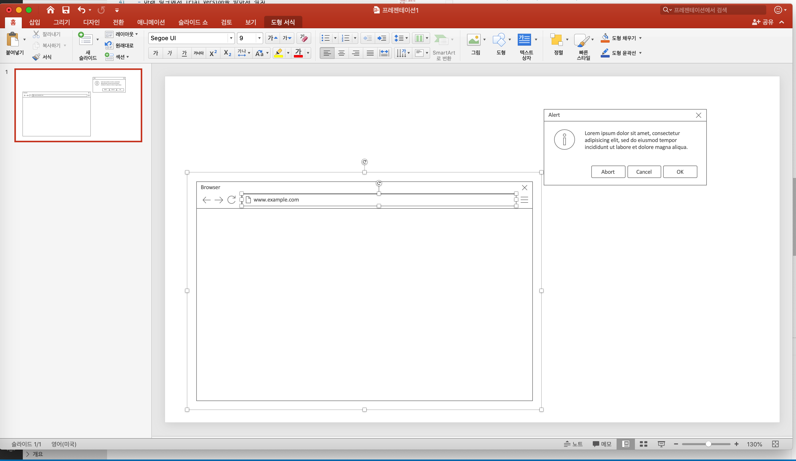

# 화면정의서를 만들기 위한 Tool

## 1. Oven

### 장점
- **무료**
- **웹 브라우저에서 모든 작업 진행 가능**
- **사용법이 간단한 편**
- **디자인이 매우 심플하고 보기 좋음 👍**
- **Prototyping 시 링크 기능이 매우 유용함**  
    - 버튼을 눌렀을 때 해당 페이지로 이동 가능

### 단점
- **생각대로 잘 동작하지 않음**  
    - 특히 테이블 생성 후 폭 조정이나 행추가 컬럼 추가 등이 기능은 있으나 생각처럼 잘 동작하지 않는다;;
- **object 간 간격조정 기능이 좀 아쉬움**
     - 절대 powerpoint나 draw.io 같은 툴을 생각하면 안됨

## 2. PowerMockup

### 장점
- **파워포인트와의 호환성**
    - 산출물이 ppt 파일로 나와야 할 경우 엄청난 장점
- **다양하고 편리한 기능 제공**
    - 자세한 기능은 [홈페이지](https://www.powermockup.com/)를 참고

### 단점
- **유료**
    - 블로거, 기자, Microsoft MVP 에게는 무료 라이센스를 제공  
    (https://www.powermockup.com/order/free-license)
- **파워포인트 종속성**
- **Windows OS 만 지원**

> 둘 다 써봤지만 결국 `PowerMockup` 을 사용하기로 결정

# PowerMockup 설치
- 아래 링크에서 Trial Version을 받아서 설치  
https://www.powermockup.com/

- 반드시 PowerPoint는 종료한 상태에서 설치를 진행해야 함

> **😫 Mac OS에서는 설치 불가!!!**   
개발하려고 했는데 Office for Mac은 필요한 인터페이스를 제공하지 않았다고 한다 ㅠ

# PowerMockup 사용하기

- 화면 상단 메뉴바에 `PowerMockup` 탭이 추가됨

- 화면 우측에서 모형을 검색해서 Drag & Drop으로 페이지에 추가하면 됨

    

## PowerMockup이 설치되지 않은 다른 PC에서 파일 확인 시

- 도형 서식으로 편집 가능

    

> Free Trial 라이센스로는 추가할 수 있는 모형이나 기능의 제약이 있어서  
PowerMockup 에 무료 라이센스를 요청한 후   
추가로 PowerMockup에 대해 포스팅 하도록 하겠습니다~^^
