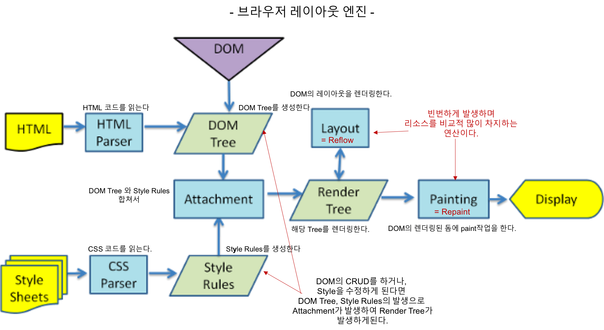

## Vue.js 란?
- 2014 년 11월 9일에 Vue.js v0.11 Release 후 현재 v2.6.10 까지 Release 됨
- 중국인 [EVAN YOU](https://blog.evanyou.me/) 가 개발 
- Vue layer에 초점을 맞추어 핵심 라이브러리가 개발됨
- 점진적 확장 및 다른 라이브러리나 기존 프로젝트와의 통합에 매우 유리
- Lean & Small (**16KB** minified and gzipped)
- SPA(Single Page Application) 또는 Dynamic UI 의 웹 페이지를 만들 때 유리

> Vue.js는 사용자 인터페이스를 만들기 위한 progressive framework

## Vue.js 주요 컨셉
### Single File Component
- 하나의 `.vue`파일에서 HTML/CSS/JavaScript를 모두 기술하게 함
  ```js
  <!-- my-component.vue -->
  <template>
    <div>이 곳은 사전에 컴파일 됨</div>
  </template>
  <script src="./my-component.js"></script>
  <style src="./my-component.css"></style>
  ```
- **관심사의 분리**
  - 타입별 파일 분리하는 것이 아니라 느슨하게 결함 된 컴포넌트로 나누어 구성
  - Single File Component 컨셉을 지키게 되면 컴포넌트의 응집력과 유지 보수성이 좋아짐

> 현대적인 UI 개발에서 코드베이스를 서로 얽혀있는 세 개의 거대한 레이어로 나누는 대신, 느슨하게 결합 된 컴포넌트로 나누고 구성하는 것이 더 중요 

## Inspired by MVVM Pattern
  

<sup>이미지 출처 : 
[Vue.js 입문서 - 프론트엔드 개발자를 위한](https://joshua1988.github.io/web_dev/vuejs-tutorial-for-beginner/)
</sup>

- MVVM(Model-View-ViewModel)
- 모델과 뷰 사이에 뷰모델이 위치하는 구조
- 화면 앞단의 회면 동작 관련 로직과 뒷단의 DB 데이터 처리 및 서버 로직을 분리하고, 뒷단에서 넘어온 데이터를 Model 에 담아 View 로 넘어주는 중간 지점


## Virtual DOM
**효율적인 DOM 조작을 위해 사용**

### 브라우저의 Workflow

<sup>이미지 출처 : 
[ReactJS의 Virtual DOM과 Repaint, Reflow](http://blog.drakejin.me/React-VirtualDOM-And-Repaint-Reflow/)
</sup>
- 브라우저가 전달받은 HTML을 파싱하여 DOM 트리를 만듬 (HTML Element 👉 DOM Node)
- CSS 파일과 inline style 파싱
- Attachment : 각 DOM 노드들의 스타일 처리하는 과정  
(DOM Tree + Style Rules = Render Tree)
- Layout : 각 노드들의 스크린의 좌표가 주어짐
- Painting : 렌더링 된 요소들에 색을 입히는 과정


😫**동적인 UI를 만들 경우 DOM과 CSS 조작이 매우 빈번하게 일어나게 되고 Reflow(Layout)와 Repaint 작업이 계속 일어나게 된다. 이 작업들은 리소스를 상대적으로 많이 차지하는 연산임**
> 예를 들어 30개의 노드를 하나 하나 수정하면, 그 뜻은 30번의 (잠재적인) 레이아웃 재계산과 30번의 (잠재적인) 리렌더링을 초래한다는 뜻입니다.

😎**이런 비효율을 개선하기 위해 Virtual DOM이 등장**  


<sup>이미지 출처: 
[Virtual Dom](https://medium.com/naukri-engineering/naukriengineering-virtual-dom-fa8019c626b)</sup>
- Virtual DOM은 실제 브라우저에 렌더링 하지 않고 메모리 상에만 존재하는 개념이므로 연산 비용이 매우 적음
- Real DOM 대신 DOM 트리의 변화를 체크하고 모든 변화를 하나로 묶어서 던져주면 연산의 횟수를 줄일 수 있음
  (~~연산의 규모는 커질 수 있지만~~)

## Vue.js 관련 라이브러리
- Vue.js는 Vue layer에 초점을 맞추어 핵심 라이브러리가 개발되었기 때문에 실제 Application 개발 시에는 Vue.js 관련 library를 사용이 거의 필수
- 엄선된 Vue.js 관련 library 리스트 : [https://github.com/vuejs/awesome-vue](https://github.com/vuejs/awesome-vue#components--libraries)


# 참고자료
[Vue.js 입문서 - 프론트엔드 개발자를 위한](https://joshua1988.github.io/web_dev/vuejs-tutorial-for-beginner/)  
[Vue.js 살펴보기](http://jeonghwan-kim.github.io/vue/2017/03/27/vue.html)  
[가상 돔과 돔의 차이점](http://webframeworks.kr/tutorials/translate/virtual-dom/)  
[[번역] 리액트에 대해서 그 누구도 제대로 설명하기 어려운 것 – 왜 Virtual DOM 인가?](https://velopert.com/3236)  
[[Vuetorials] 2. 전반적인 concept](https://jaeyeophan.github.io/2018/10/21/Vuetorials-2-Vue-concept/)  
[Vue Mastery-Our Courses](https://www.vuemastery.com/courses)